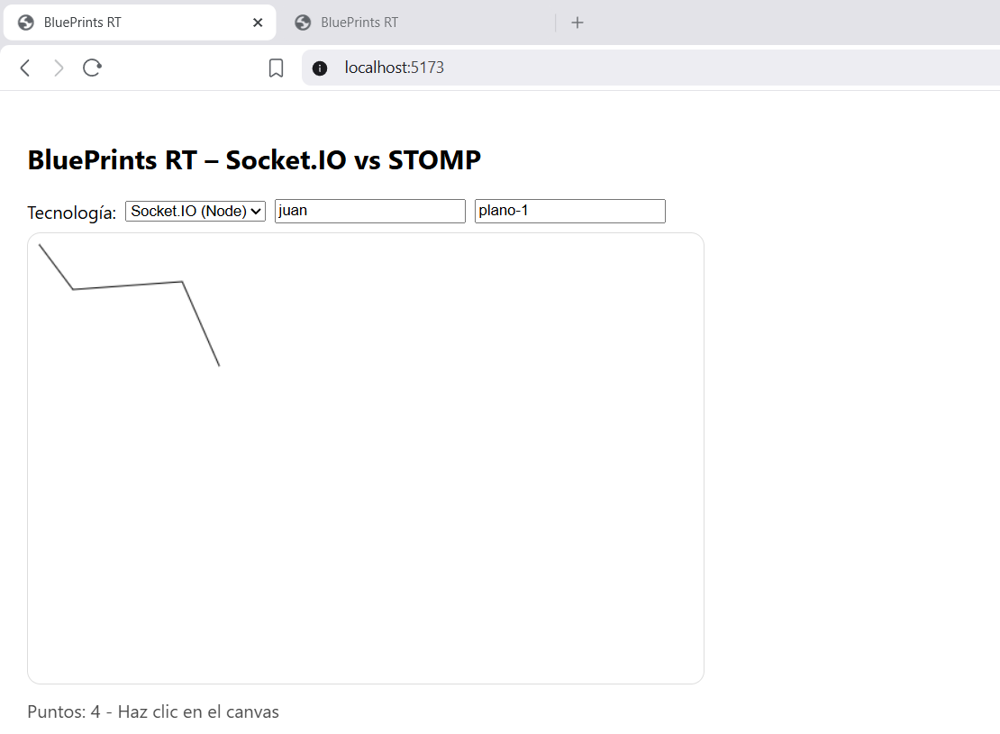
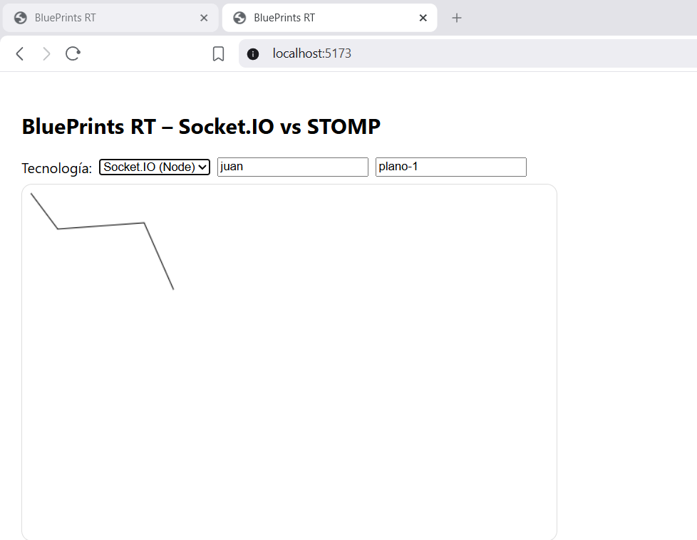
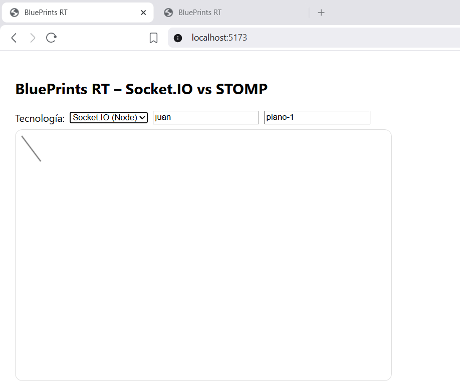

# Lab P4 — BluePrints en Tiempo Real (Socket.IO)

**Repositorio:** `DECSIS-ECI/Lab_P4_BluePrints_RealTime-Sokets`  
**Frontend:** React + Vite  
**Backend RT:** Socket.IO (Node.js)

---

## Tabla de Contenido
- [Objetivo](#objetivo)
- [Arquitectura](#arquitectura)
- [Tecnologías Usadas](#tecnologías-usadas)
- [Setup y Ejecución](#setup-y-ejecución)
- [Endpoints CRUD](#endpoints-crud)
- [Protocolo Socket.IO](#protocolo-socketio)
- [Decisiones de Implementación](#decisiones-de-implementación)
- [Casos de Prueba](#casos-de-prueba)
- [Video de Demostración](#video-de-demostración)
- [Troubleshooting](#troubleshooting)
- [Autores](#autores)
- [Licencia](#licencia)

---

## Objetivo

Implementar **colaboración en tiempo real** para el caso de BluePrints. El frontend consume una API CRUD y habilita tiempo real usando **Socket.IO**, permitiendo que múltiples clientes dibujen el mismo plano de forma simultánea.

### Requisitos cumplidos:
- Integración con API CRUD (listar, crear, actualizar, eliminar planos)
- Conexión a backend de tiempo real con Socket.IO
- Colaboración en vivo (2 pestañas navegando el mismo plano)

---

## Arquitectura
React (Vite) ── HTTP ──────────────────> Backend Socket.IO (Node)  
└─ Socket.IO (rooms) ──> broadcast a sala

text

### Convenciones usadas:
- Sala (room): `blueprints.{author}.{name}`
- Payload de punto: `{ x, y }`

---

## Tecnologías Usadas

### Frontend
- React 18 + Vite
- Socket.IO Client
- Canvas API para dibujo

### Backend
- Node.js + Express
- Socket.IO
- Almacenamiento en memoria (para este lab)

---

## Setup y Ejecución

### Requisitos previos
- Node.js v18+ (v20 LTS recomendado)
- npm

### 1) Backend Socket.IO

```bash
git clone https://github.com/DECSIS-ECI/example-backend-socketio-node-.git
cd example-backend-socketio-node-
npm install
npm run dev
# Servidor en http://localhost:3001
```

### 2) Frontend

```bash
git clone https://github.com/DECSIS-ECI/Lab_P4_BluePrints_RealTime-Sokets.git
cd Lab_P4_BluePrints_RealTime-Sokets
npm install
```

Crear archivo .env.local en la raíz:

```bash
VITE_API_BASE=http://localhost:3001
VITE_IO_BASE=http://localhost:3001
```

Ejecutar:

```bash
npm run dev
# Frontend en http://localhost:5173
```

### 3) Probar
Abrir http://localhost:5173

Seleccionar Socket.IO en el selector RT

Autor: juan, Plano: plano-1

Abrir dos pestañas con la misma configuración

Dibujar en una → los puntos aparecen en la otra

---

## Endpoints CRUD
El backend Socket.IO modificado incluye estos endpoints:

| Método | Endpoint | Descripción |
|---|---:|---|
| GET | /api/blueprints?author=:author | Lista planos del autor (incluye total de puntos) |
| GET | /api/blueprints/:author/:name | Obtiene puntos de un plano |
| POST | /api/blueprints | Crea un nuevo plano |
| PUT | /api/blueprints/:author/:name | Actualiza puntos de un plano |
| DELETE | /api/blueprints/:author/:name | Elimina un plano |

Ejemplo de respuesta GET /api/blueprints?author=juan

```json
[
  {
    "name": "plano-1",
    "points": [{ "x": 10, "y": 10 }, { "x": 40, "y": 50 }]
  },
  {
    "name": "plano-2",
    "points": []
  }
]
```

Total de puntos por autor (cálculo con reduce)

```js
const total = blueprints.reduce((sum, bp) => sum + bp.points.length, 0);
```

---

## Protocolo Socket.IO

Eventos Cliente → Servidor

| Evento | Payload | Descripción |
|---|---|---|
| join-room | "blueprints.juan.plano-1" | Unirse a una sala |
| draw-event | { room, author, name, point } | Enviar punto dibujado |

Eventos Servidor → Cliente

| Evento | Payload | Descripción |
|---|---|---|
| blueprint-update | { author, name, points: [point] } | Broadcast de nuevo punto |

Ejemplo de implementación en el frontend:

```js
// Unirse a sala
socket.emit('join-room', `blueprints.${author}.${name}`);

// Enviar punto
socket.emit('draw-event', { room, author, name, point });

// Recibir punto
socket.on('blueprint-update', (upd) => {
  setPoints(prev => [...prev, ...upd.points]);
});
```

---

## Decisiones de Implementación

1. Elección de tecnología: Socket.IO  
Se eligió Socket.IO por:
- Simplicidad: API intuitiva y directa
- Reconexión automática: Maneja caídas de red sin código adicional
- Salas (rooms): Ideales para aislar planos por autor/nombre
- Fallbacks: Si WebSocket falla, usa HTTP long-polling

2. Estructura de salas  
text  
`blueprints.{author}.{name}`  
Esto asegura que solo los clientes que ven el mismo plano reciban las actualizaciones.

3. Manejo de estado  
`points[]`: Arreglo de puntos en el plano actual  
Actualización local inmediata + envío por Socket.IO  
Al recibir puntos, se actualiza el estado y se redibuja

4. Selector de tecnología  
Aunque el laboratorio permite Socket.IO o STOMP, implementamos ambas opciones en el frontend, pero el backend activo es Socket.IO.

---

## Prueba



En la ventana 2 aparece lo mismo que en la ventana 1



 y cuando se elimina pasa lo mismo




